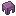
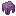
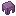
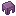

# item/generated… builtin/generated

很多人第一次接触物品的模型都是从类似如下的 json 开始的：

```json
{
  "parent": "minecraft:item/generated",
  "textures": {
    "layer0": "minecraft:item/iron_ingot"
  }
}
```

item/generated 在 minecraft/models/item/generated.json 中定义，其继承了一个内置的模型类型 builtin/generated。

在 ItemModelGenerator#generateBlockModel 中使用 sprite 生成每一帧的模型，帧是原版的[动图](https://minecraft.wiki/w/Resource_pack#Animation)。

以潜影壳为例：

上像素，合并相同 y 的 span，共 5 个 span：



下像素，合并相同 y 的 span，共 6 个 span：



左像素，合并相同 x 的 span，共 6 个 span：



右像素，合并相同 x 的 span，共 8 个 span：



总计 25 个 span。

每个 span 都会被变成只有一个对应方向的面的 BlockElement，再加上前后两面共一个 BlockElement 总计 26 个 BlockElement 27 个面。