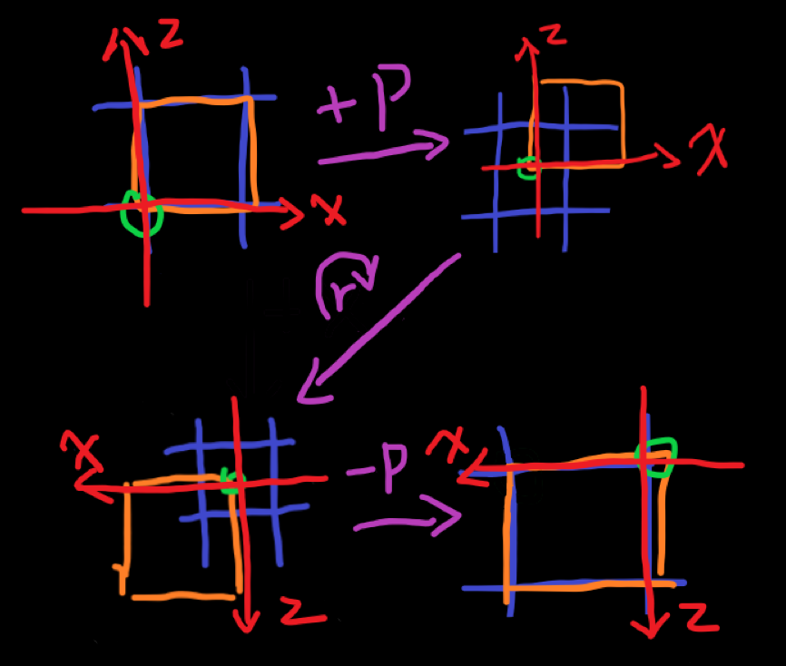

# 梦的开始

实体、方块实体、GUI…吸引一波又一波的人为了更好的视觉效果不断探索，欢迎各位冒险家来到渲染的世界！

## EntityRenderer

render 方法参数如下：

- **T entity**

代表实体；

- **float entityYaw**

代表实体的 y 轴旋转。

yaw 叫做“偏航角”，用于原版万家左右转，与 yaw、pitch、roll 共同描述一组旋转角度。

pitch 为“俯仰角”，绕着 x 轴旋转，用于原版玩家上下看。

roll 在原版使用很少，是“滚转角”，绕着 y 轴旋转；

- **float partialTick**

距离上一渲染帧的 tick 数，例：假设运行时稳定为 60fps，每帧 16.6ms，此时获取 partialTick 为 16.6ms / 20ms = 0.33tick。

此值常用于插值，但注意此值可能大于 1；

- **PoseStack poseStack**

记录了当前环境的变换，有 Matrix4f pose（位姿）与 Matrix3f normal（法线）组成。

在 1.19.2 之后，mc 的数学运算库改为 [joml](https://joml-ci.github.io/JOML/)。

用 Matrix4f 的缘由是除了矩阵本身表达的旋转和缩放之外还需要额外的位移参数。

可以使用 Matrix3f + Vector3f 共同表示变换，但使用仿射变换的方式可以使表达更统一，且效果相同。

新人常常不知道旋转的机制是怎样的，实际上，旋转的中心与矩阵的位移位置是相同的，而旋转轴则和旋转角度有关。

如下图例，演示了 ChestRenderer 中箱子的旋转方式：

- **MultiBufferSource bufferSource**
  
MultiBufferSource 相当于 Function\<RenderType, VertexConsumer\>。

RenderType 是对材料的包装，定义了顶点格式、OpenGL 上下文以及着色器。

写过旧版本 mc 的人可能有过手动调用例如 glEnable(GL_BLEND)/glDisable(GL_BLEND) 或者类似内容的经历，RenderStateShard 就是对这类内容的包装。

VertexConsumer 是对 VBO 的包装，储存顶点数据；

- **int packedLight**

实体当前位置的天光与方块光组合成的一个 int，具体定义在 LightTexture 类中；

以 WitherSkullRenderer 为例，推荐的模型渲染流程如下：

1. 获取 VertexConsumer
2. 进行一定的变换
3. 进行动画的计算应用动画
4. 调用 ModelPart 或类似的模型的 render 方法

ModelPart 是原版的模型格式，可以用 [BlockBench](https://www.blockbench.net/) 进行建模。

类似 ModelPart，原版还有物品/方块的模型 BlockModel 和对应的 BakedModel，在实体中渲染可以参考 ItemFrameRenderer。

## BlockEntityRenderer
render 参数如下：

- **T blockEntity**

代表方块实体；

- **float partialTick**
- **PoseStack poseStack**
- **MultiBufferSource bufferSource** 
- **int packedLight** 
- **int packedOverlay**

类似 light，同样是一个坐标代表 overlay 上的位置，原版常用于受伤时发红及苦力怕欲爆炸发白，定义位于 OverlayTexture；
